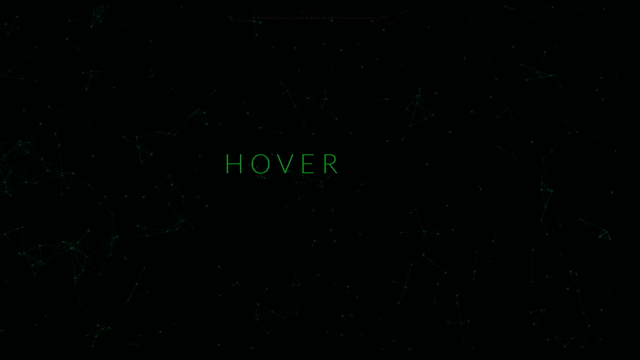

# JS-Mouse-Parallax-Demo

A really interesting Parallax demo which creates Cloudflare particles that follow the mouse movement.  

#JavaScript libraries used: 
<ul>
  <li>https://cdnjs.cloudflare.com/ajax/libs/jquery/2.1.3/jquery.min.js</li>
  <li>https://cdnjs.cloudflare.com/ajax/libs/particles.js/2.0.0/particles.min.js</li>
  <li>https://matthew.wagerfield.com/parallax/deploy/jquery.parallax.js</li>
</ul>

To change colors, you must edit the value inside the script.js file

